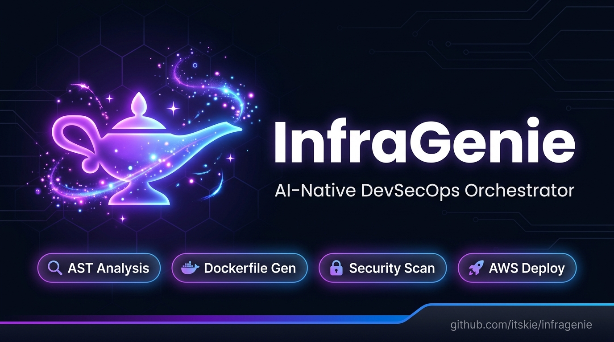
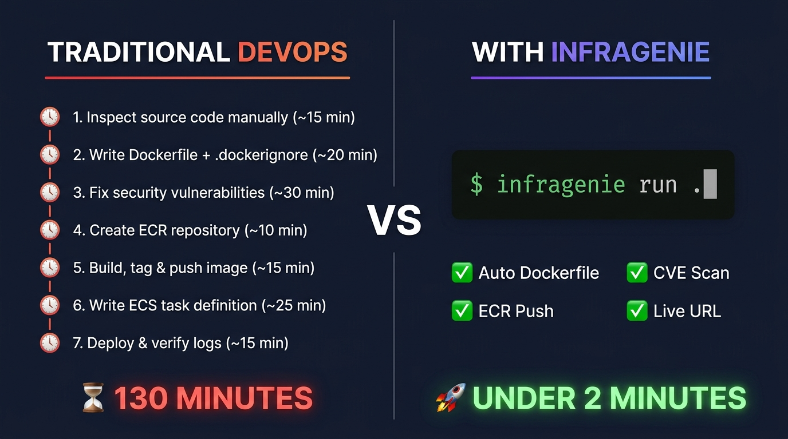
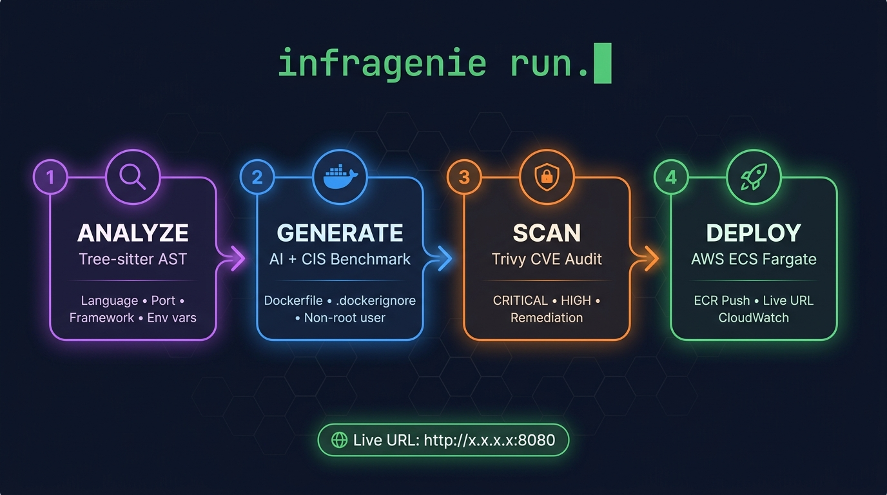

<div align="center">

# 🧞 InfraGenie
### Autonomous AI-Native DevSecOps Orchestrator
**Zero-touch secure containerization, automated vulnerability triage, and production AWS cloud deployment.**

[](https://python.org)
[](https://aws.amazon.com/ecs/)
[](https://www.cisecurity.org/)
[](https://github.com/kie/infragenie)
[](https://github.com/itskie/infragenie/actions/workflows/ci.yml)
[](tests/)
[](LICENSE)




---

[Key Highlights](#-key-highlights) • [DevOps ROI](#-the-roi-why-devops-engineers--teams-love-infragenie) • [The 1-Click Pipeline](#-the-magic-button-infragenie-run) • [Architecture](#-architecture--pipeline-overview) • [Languages](#-supported-languages--frameworks) • [AI Providers](#-supported-ai-providers) • [CLI Commands](#-cli-commands--linux-style-short-flags) • [Prerequisites](#-prerequisites) • [Quickstart](#-installation--quickstart) • [Contributing](#-contributing)

</div>

## 😤 The Problem

You've built a great Python/Go/Node app. Now you want to deploy it to AWS.

Suddenly you need to:
- Write a Dockerfile (correctly, securely, with multi-stage builds)
- Create an ECR repository and push your image
- Configure VPC, subnets, IAM roles, task definitions
- Set up CloudWatch logging and health checks
- Fix all the security vulnerabilities Trivy flags

That's **2+ hours of boilerplate** before your app is even running.

**InfraGenie eliminates all of it.** Point it at any project folder — it reads your code, generates a hardened Dockerfile via AI, scans for vulnerabilities, and deploys a live URL on AWS ECS Fargate. One command.

```bash
infragenie run .   # That's it.
```

---

## 🚀 Key Highlights

- 🔍 **Deterministic AST Analysis:** Parses projects with **Tree-sitter** without sending raw source code over the network. Discovers frameworks, exposed ports, environment variable bindings, and `/health` endpoints.
- 🧠 **Multi-LLM Swappable AI Engine:** Seamlessly switch between **Google Gemini 2.5 Flash**, **Anthropic Claude 3.5 Sonnet**, **OpenAI GPT-4o**, or **Local Offline Ollama (LLaMA 3.2)** via a unified provider layer.
- 🛡️ **CIS Benchmark Docker Generation:** Generates production-hardened multi-stage Dockerfiles enforcing unprivileged users (`appuser:1001`), `.dockerignore` secret masking, build caching, and explicit health checks.
- 🔒 **Automated Security Triage:** Scans filesystems and container images with **Trivy**, categorizing vulnerabilities by severity and generating AI-assisted remediation fixes.
- ☁️ **Serverless AWS Deployment & Teardown:** Automatically provisions Amazon ECR repositories, registers versioned ECS task definitions, executes rolling deployments to ECS Fargate, and provides 1-command cleanup via `infragenie rm -f`.
- 🩺 **Dynamic OS-Aware Health Engine (`infragenie doctor`):** Auto-detects macOS, Ubuntu, Debian, Fedora, RHEL, Arch Linux, and Windows WSL, providing tailored installation guidance.
- 🐧 **Linux-Native CLI & Official Manpage:** Linux short flags (`-h`, `-v`, `-o`, `-d`, `-i`, `-s`, `-t`, `-c`, `-f`), POSIX standard exit codes, and an official Unix manual (`man infragenie`).

---

## ⏱️ The ROI: Why DevOps Engineers & Teams Love InfraGenie

<p align="center">
  
</p>


In modern microservice architectures, onboarding a new service to AWS takes hours of repetitive, error-prone manual labor. **InfraGenie cuts that down to under 120 seconds.**

```
┌──────────────────────────────────────────────┐       ┌──────────────────────────────────────────────┐
│       TRADITIONAL DEVOPS WORKFLOW            │       │          WITH INFRAGENIE ORCHESTRATOR        │
├──────────────────────────────────────────────┤       ├──────────────────────────────────────────────┤
│ 1. Inspect source code manually     (~15m)   │       │                                              │
│ 2. Draft Dockerfile + .dockerignore  (~20m)   │       │                                              │
│ 3. Fix security vulnerabilities      (~30m)   │  ───> │  ⚡ infragenie run .                         │
│ 4. Create Amazon ECR repository      (~10m)   │       │     (Zero human intervention needed)         │
│ 5. Build, tag, and push container    (~15m)   │       │                                              │
│ 6. Write ECS Task Definition JSON    (~25m)   │       │                                              │
│ 7. Deploy & verify CloudWatch logs   (~15m)   │       │                                              │
├──────────────────────────────────────────────┤       ├──────────────────────────────────────────────┤
│ ⏳ Total Time: ~130 Minutes per service      │       │ 🚀 Total Time: < 2 Minutes (98.5% faster!)   │
└──────────────────────────────────────────────┘       └──────────────────────────────────────────────┘
```

---

## 🪄 The Magic Button: `infragenie run`

<p align="center">
  
</p>


The `run` command is InfraGenie’s master autonomous pipeline. With one terminal command, it chains the entire DevSecOps lifecycle:

```bash
# Execute the full 4-stage pipeline autonomously:
infragenie run .

# Safe mode: Analyze -> Generate -> Security Scan (Skip cloud deployment)
infragenie run . -s

# Dry-run mode: Preview all generated configs without modifying disk or AWS
infragenie run . -d
```

```
           ┌────────────────────────────────────────────────────────┐
           │                   INFRAGENIE RUN                       │
           └────────────────────────────────────────────────────────┘
                                       │
                1. 🔍 ANALYZE (Tree-sitter AST Parser)
                   • Extracts: Language & Framework
                   • Discovers: Port, Health routes, Env vars
                                       │
                                       ▼
                2. 🐳 GENERATE (AI LLM + CIS Benchmarks)
                   • Generates: Multi-stage Dockerfile
                   • Creates: Hardened .dockerignore
                   • Enforces: Non-root user (UID 1001)
                                       │
                                       ▼
                3. 🔒 SCAN (Trivy Vulnerability Audit)
                   • Scans filesystem & image layers
                   • Passes on 0 critical CVEs
                                       │
                                       ▼
                4. 🚀 DEPLOY (AWS Cloud Engine)
                   • Pushes image to Amazon ECR
                   • Registers AWS ECS Task Definition
                   • Deploys live service to AWS ECS Fargate
```

---

## 🏗️ Architecture & Pipeline Overview

```
                      🧞 INFRAGENIE CORE ENGINE
                      
 📁 Source Code
       │
       ▼
 ┌──────────────────────┐
 │  Semantic Analyzer   │ ───> AST Parsing (Port, Env, Health, Stack)
 └──────────────────────┘
       │ (Structured AnalysisReport)
       ▼
 ┌──────────────────────┐      ┌──────────────────────────────┐
 │ Dockerfile Generator │ <──> │ Multi-LLM Engine (Gemini/GPT)│
 └──────────────────────┘      └──────────────────────────────┘
       │ (Dockerfile + .dockerignore)
       ▼
 ┌──────────────────────┐
 │   Security Scanner   │ ───> Trivy CVE Analysis + AI Triage
 └──────────────────────┘
       │ (Passed Security Report)
       ▼
 ┌──────────────────────┐
 │ AWS Cloud Deployer   │ ───> Amazon ECR Push ──> AWS ECS Fargate Rollout
 └──────────────────────┘
       │
       ▼
 ┌──────────────────────┐
 │ AWS Teardown Engine  │ ───> infragenie rm -f (Instant Cost Cleanup)
 └──────────────────────┘
```


---

## 🌐 Supported Languages & Frameworks

InfraGenie's Tree-sitter AST engine detects the following tech stacks **without any configuration**:

| Language | Frameworks Auto-Detected | Package Managers |
|---|---|---|
| 🐍 **Python** | FastAPI, Flask, Django | pip, uv, poetry |
| 🟨 **JavaScript** | Express.js, Next.js | npm, yarn, pnpm |
| 🔷 **TypeScript** | Express.js, Next.js | npm, yarn, pnpm |
| 🐹 **Go** | Gin, Echo | go modules |
| 🦀 **Rust** | Actix, Axum | cargo |
| ☕ **Java** | Spring Boot | maven, gradle |


---

## 🤖 Supported AI Providers

InfraGenie provides a vendor-agnostic LLM interface. Switch between cloud LLMs or run 100% locally:

| Provider | Model | Speed | Best For | Configuration Key in `.env` |
|---|---|---|---|---|
| **Google AI Studio** | `gemini-2.5-flash` | ⚡ Ultra Fast | Production Default | `LLM_PROVIDER=google`<br>`GOOGLE_API_KEY=your_key` |
| **Anthropic** | `claude-3-5-sonnet-20241022` | 🧠 Deep Logic | Complex Multi-Service | `LLM_PROVIDER=anthropic`<br>`ANTHROPIC_API_KEY=your_key` |
| **OpenAI** | `gpt-4o` | ⚡ Balanced | General Purpose | `LLM_PROVIDER=openai`<br>`OPENAI_API_KEY=your_key` |
| **Ollama** | `llama3.2` | 🔒 100% Offline | Air-Gapped / Privacy | `LLM_PROVIDER=ollama`<br>`OLLAMA_BASE_URL=http://localhost:11434` |

---

## 🩺 System Health Diagnostics: `infragenie doctor`

Run pre-flight checks on your environment before starting a deployment:

```bash
infragenie doctor
# or fast short form:
infragenie doc
```

```
                          System & Cloud Health Check                           
┏━━━━━━━━━━━━━━━━━━━━━━┳━━━━━━━━━━━━━━━━━━┳━━━━━━━━━━━━━━━━━━━━━━━━━━━━━━━━━━━━┓
┃ Component            ┃ Status           ┃ Details & Action Items             ┃
┡━━━━━━━━━━━━━━━━━━━━━━╇━━━━━━━━━━━━━━━━━━╇━━━━━━━━━━━━━━━━━━━━━━━━━━━━━━━━━━━━┩
│ Operating System     │ ✅ Detected      │ macOS / Ubuntu / Fedora / Arch     │
├──────────────────────┼──────────────────┼────────────────────────────────────┤
│ Python Runtime       │ ✅ Ready         │ Python 3.9+ Virtual Environment    │
├──────────────────────┼──────────────────┼────────────────────────────────────┤
│ AI LLM Provider      │ ✅ Configured    │ Provider: google (gemini-2.5-flash)│
├──────────────────────┼──────────────────┼────────────────────────────────────┤
│ Docker Engine        │ ✅ Active        │ Binary: /usr/bin/docker (Running)  │
├──────────────────────┼──────────────────┼────────────────────────────────────┤
│ Trivy Scanner        │ ✅ Installed     │ Binary: /usr/local/bin/trivy       │
├──────────────────────┼──────────────────┼────────────────────────────────────┤
│ AWS Cloud Connection │ ✅ Connected     │ Account: 123456789012 (ap-south-1) │
└──────────────────────┴──────────────────┴────────────────────────────────────┘
```

---

## 🐧 Cross-Platform OS Support

InfraGenie automatically recognizes your OS and tailors setup recommendations:

| Operating System | Docker Setup Guide | Security Scanner (Trivy) |
|---|---|---|
| **macOS (Darwin)** | `brew install --cask docker` (or docker) | `brew install trivy` |
| **Ubuntu / Debian** | `sudo apt install docker.io -y && sudo systemctl start docker` | `sudo apt install trivy` |
| **Fedora / RHEL / CentOS** | `sudo dnf install docker -y && sudo systemctl start docker` | `sudo dnf install trivy` |
| **Arch Linux** | `sudo pacman -S docker --noconfirm && sudo systemctl start docker` | `sudo pacman -S trivy` |
| **Windows (WSL2)** | Install Docker Desktop for Windows | `choco install trivy` |

---

## 💻 CLI Commands & Linux-Style Short Flags

All InfraGenie commands support intuitive Linux single-character short flags:

```bash
infragenie -h           # Global help menu
infragenie -v <command> # Global debug flag
```

| Command | Full Form | **⚡ Linux Short Form** | Description |
|---|---|---|---|
| **Analyze** | `infragenie analyze . --output report.json` | **`infragenie analyze . -o report.json`** | Inspect stack, ports, envs & health endpoints |
| **Generate** | `infragenie generate . --dry-run` | **`infragenie generate . -d`** | Generate hardened Dockerfile via AI |
| **Scan** | `infragenie scan my-app:latest --image` | **`infragenie scan my-app:latest -i`** | Run Trivy vulnerability audit |
| **Deploy** | `infragenie deploy . --tag v1.0 --count 2` | **`infragenie deploy . -t v1.0 -c 2`** | Push to Amazon ECR & update ECS Fargate |
| **Run** | `infragenie run . --skip-deploy` | **`infragenie run . -s`** | 1-Click Master Pipeline (Analyze → Generate → Scan) |
| **Remove** | `infragenie rm my-app --force` | **`infragenie rm my-app -f`** | Instant AWS Cloud Teardown (Linux `rm -f` convention) |
| **Remove (keep images)** | `infragenie rm my-app --force --no-ecr` | **`infragenie rm my-app -f --no-ecr`** | Teardown ECS only — keep ECR Docker images |
| **Doctor** | `infragenie doctor` | **`infragenie doc`** | Inspect system, Docker, AI keys & AWS connection |

---

## 📖 Official Unix Man Page

InfraGenie includes a native troff/groff manual page for terminal users:

```bash
# Open the official Unix manual:
man infragenie
```

---

## ⚙️ Environment Configuration (`.env` Setup Guide)

InfraGenie uses standard environment variables loaded from a `.env` file in your workspace or project root.

### 1. Create your `.env` file
Copy the provided template to get started:
```bash
cp .env.example .env
```

### 2. Configure Your AI Engine (Choose Any One)

#### Option A: Google Gemini (Recommended & Default)
```env
LLM_PROVIDER=google
GOOGLE_API_KEY=AIzaSy...
GOOGLE_MODEL=gemini-2.5-flash
```

#### Option B: OpenAI GPT-4o
```env
LLM_PROVIDER=openai
OPENAI_API_KEY=sk-proj-...
OPENAI_MODEL=gpt-4o
```

#### Option C: Anthropic Claude 3.5 Sonnet
```env
LLM_PROVIDER=anthropic
ANTHROPIC_API_KEY=sk-ant-...
ANTHROPIC_MODEL=claude-3-5-sonnet-20241022
```

#### Option D: 100% Offline Local Ollama (Zero API Costs)
```env
LLM_PROVIDER=ollama
OLLAMA_BASE_URL=http://localhost:11434
OLLAMA_MODEL=llama3.2
```

---

### 3. Configure AWS Cloud Access

InfraGenie supports standard AWS CLI credentials, IAM profiles, and environment variables:

```env
# AWS Region to deploy into (e.g. ap-south-1 for Mumbai, us-east-1 for N. Virginia)
AWS_REGION=ap-south-1

# Option 1: Use existing AWS CLI profile (Recommended)
AWS_PROFILE=default

# Option 2: Direct IAM Access Keys (For CI/CD pipelines)
# AWS_ACCESS_KEY_ID=AKIA...
# AWS_SECRET_ACCESS_KEY=...
```

---

### 4. Optional Enterprise & Custom Overrides

By default, InfraGenie **automatically auto-provisions IAM roles, VPC subnets, and ECS clusters**. If your company requires pre-approved enterprise infrastructure, you can override them:

| Variable | Default | Description |
|---|---|---|
| `ECS_CLUSTER_NAME` | `infragenie-cluster` | Target AWS ECS cluster name (auto-created if missing) |
| `ECS_TASK_EXECUTION_ROLE_ARN` | *(Auto-provisioned)* | Custom pre-approved IAM Execution Role ARN |
| `ECS_PRIVATE_SUBNET_IDS` | *(Auto-discovered)* | Custom VPC subnets (comma-separated: `subnet-a,subnet-b`) |
| `ECS_SECURITY_GROUP_IDS` | *(Auto-discovered)* | Custom Security Group IDs (comma-separated: `sg-1,sg-2`) |
| `TRIVY_SEVERITY` | `HIGH,CRITICAL` | Vulnerability severity thresholds for security audit |
| `LOG_LEVEL` | `INFO` | Logging level (`DEBUG`, `INFO`, `WARNING`, `ERROR`) |


## 📦 Prerequisites

Before running InfraGenie, ensure the following are available on your machine:

| Requirement | Version | Purpose | Install |
|---|---|---|---|
| **Python** | 3.9+ | Runtime | [python.org](https://python.org) |
| **Docker** | 24.0+ | Container build & push | `brew install --cask docker` (macOS) |
| **AWS CLI** | 2.x | Cloud credential setup | `brew install awscli` |
| **AWS Account** | Any | ECS Fargate deployment target | [aws.amazon.com](https://aws.amazon.com) |
| **AI API Key** | — | Dockerfile generation (or use Ollama for free) | [Google AI Studio](https://aistudio.google.com) |

> **Tip:** Run `infragenie doctor` after setup — it validates all 5 requirements automatically and shows OS-specific fix instructions for anything missing.

---

## ⚙️ Installation & Quickstart

```bash
# 1. Clone the repository
git clone https://github.com/kie/infragenie.git
cd infragenie

# 2. Set up virtual environment
python3 -m venv .venv
source .venv/bin/activate   # Windows: .venv\Scripts\activate

# 3. Install in editable mode
pip install -e .

# 4. Configure AWS CLI (skip if already configured)
aws configure   # Enter: Access Key, Secret Key, Region (e.g. ap-south-1)

# 5. Configure your AI & AWS credentials
cp .env.example .env
# Edit .env: set LLM_PROVIDER + your chosen API key (see .env Setup Guide below)

# 6. Run pre-flight health check — verifies all 5 requirements
infragenie doctor

# 7. Containerize and deploy any app in 1 click!
cd /path/to/your/app
infragenie run .
```

> **First time?** Use `infragenie run . -s` to skip cloud deployment and just generate a Dockerfile locally.

---

## 🧪 Testing & Validation

InfraGenie includes a comprehensive test suite with 100% mocked cloud services and isolated test harnesses:

```bash
# Run all unit tests
pytest tests/ -v

# Run with test coverage report
pytest --cov=infragenie tests/
```

---

## 🤝 Contributing

Contributions are welcome! Please follow these steps:

1. **Fork** the repo and create your branch from `main`.
2. **Install dev dependencies:** `pip install -e ".[dev]"`
3. **Run tests** before submitting: `pytest tests/ -v`
4. **Code style:** `ruff check . && ruff format .`
5. **Type check:** `mypy infragenie/`
6. Open a **Pull Request** with a clear description.

For major changes, please open an issue first to discuss what you'd like to change.

---

## 📄 License

InfraGenie is open-source software licensed under the [MIT License](LICENSE).
